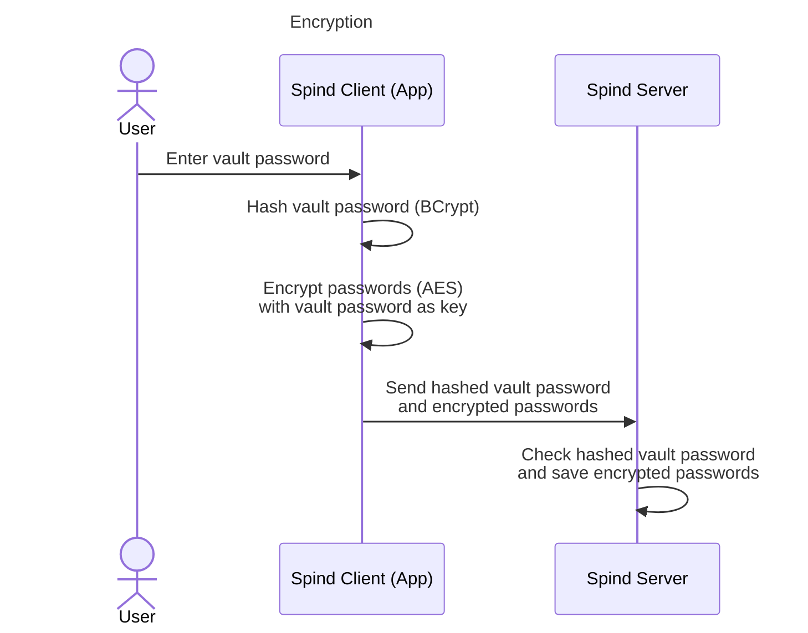
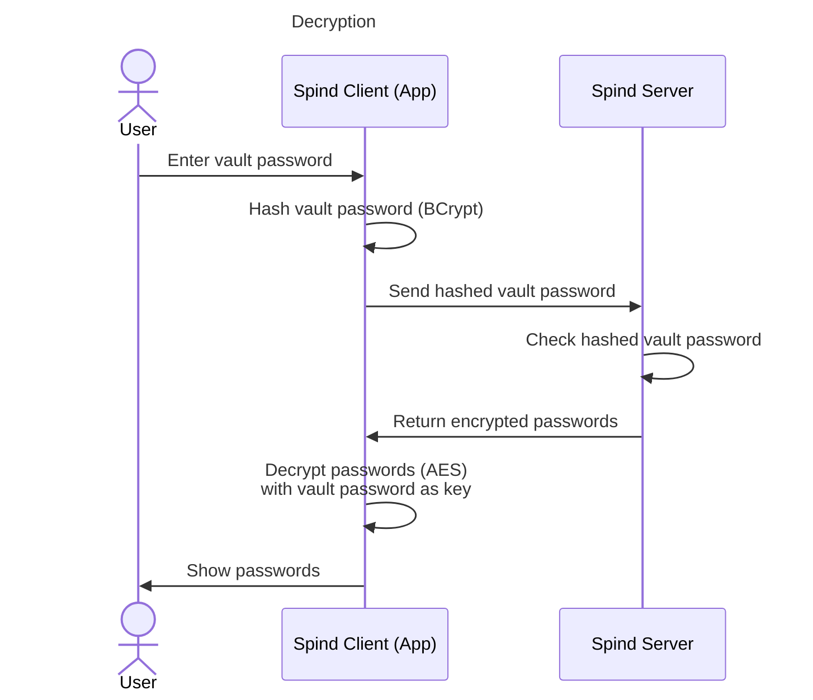

# Spind

## How it works

```mermaid
sequenceDiagram
    title Encryption
    actor User
    participant Spind Client (App)
    participant Spind Server

    User->>Spind Client (App): Enter vault password
    Spind Client (App)->>Spind Client (App): Hash vault password (BCrypt)
    Spind Client (App)->>Spind Client (App): Encrypt passwords (AES)<br>with vault password as key
    Spind Client (App)->>Spind Server: Send hashed vault password<br>and encrypted passwords
    Spind Server->>Spind Server: Check hashed vault password<br>and save encrypted passwords
```

```mermaid
sequenceDiagram
    title Decryption
    actor User
    participant Spind Client (App)
    participant Spind Server

    User->>Spind Client (App): Enter vault password
    Spind Client (App)->>Spind Client (App): Hash vault password (BCrypt)
    Spind Client (App)->>Spind Server: Send hashed vault password
    Spind Server->>Spind Server: Check hashed vault password
    Spind Server->>Spind Client (App): Return encrypted passwords
    Spind Client (App)->>Spind Client (App): Decrypt passwords (AES)<br>with vault password as key
    Spind Client (App)->>User: Show passwords
```