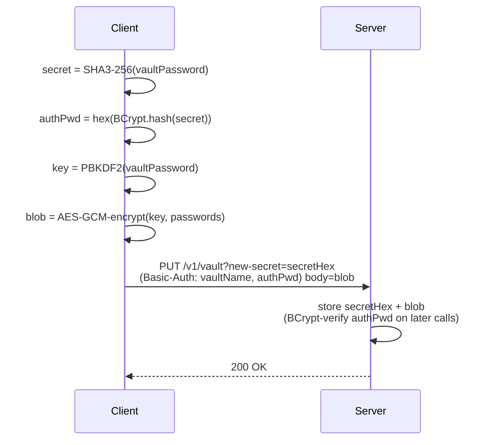
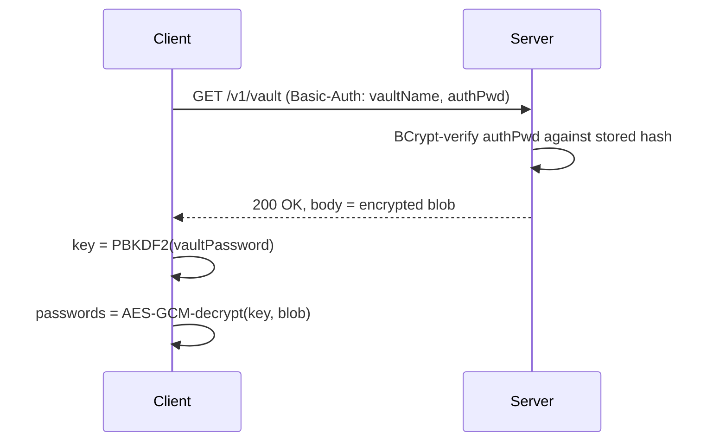

# Spind

Spind is a Kotlin Multiplatform, zero-knowledge password manager. Clients (Android and JVM desktop) encrypt vaults locally and sync the opaque encrypted blob with a self-hosted Ktor server, which only ever stores a derived secret and the encrypted blob — it can never see the master password or plaintext data.

## Architecture

- `protocol` — shared Kotlin Multiplatform library of DTOs/models exchanged between client and server.
- `app` — shared Compose Multiplatform client library: UI, Spind API client, and all client-side cryptography.
- `jvm-app` — JVM desktop application wrapper (Compose Desktop).
- `android-app` — Android application wrapper.
- `server` — Ktor/Netty backend that stores the derived secret and the encrypted vault blob and verifies the BCrypt auth credential.

## Security model

The client derives a `secret` from the vault password using **cryptography-kotlin** (`secret = SHA3-256(vaultPassword)`), then BCrypt-hashes that secret (`hex(BCrypt.hash(secret))`, via `at.favre.lib:bcrypt`) to produce the Basic-Auth password it sends to the server. The vault payload (the passwords) is AES-GCM-encrypted (cryptography-kotlin) with a key derived from the vault password via PBKDF2, so the server only ever sees the BCrypt credential and the encrypted blob — never the plaintext or the encryption key. On the first `PUT /v1/vault?new-secret=<secretHex>` the server registers the vault's secret; afterwards it stores only updates to the encrypted blob.

### Encryption flow



### Decryption flow



## Build

Spind uses **Amper / Kotlin CLI** via the `./kotlin` wrapper at the repo root (`kotlin` on Unix, `kotlin.bat` on Windows) — there is no `gradlew`. See [CONTEXT.md](./CONTEXT.md) for the full command reference. Quick start:

```shell
./kotlin show tasks            # list all tasks
./kotlin task :server:runJvm         # run the server (default port 8080)
./kotlin task :jvm-app:runJvm        # run the desktop client
./kotlin task :android-app:buildAndroidDebug   # build the Android client
```