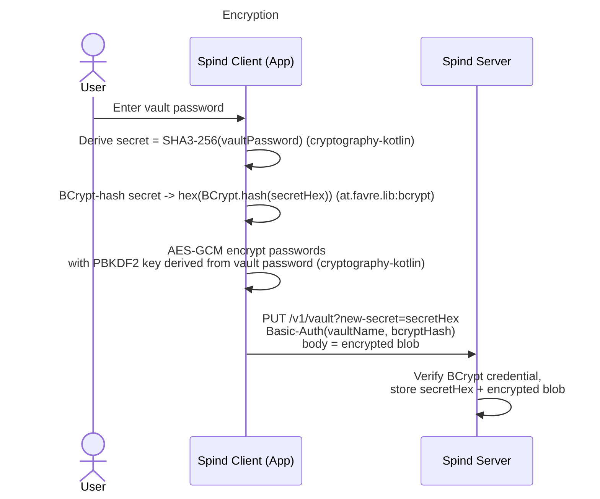
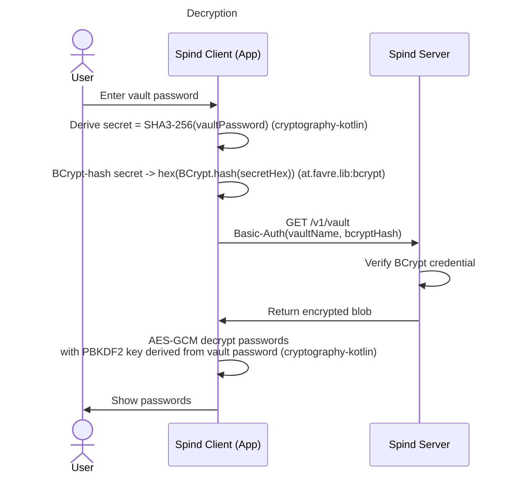

# Spind

Spind is a Kotlin Multiplatform password manager that syncs encrypted vaults with a self-hosted server. The server is zero-knowledge: it only ever stores a derived secret and the AES-GCM-encrypted blob, never the vault password or the plaintext passwords.

## How it works

The client does all cryptography with **cryptography-kotlin** (SHA3-256, AES-GCM, PBKDF2) and **at.favre.lib:bcrypt**. From the vault password it derives a `secret = SHA3-256(vaultPassword)` (its hex form `secretHex`), then BCrypt-hashes that secret to produce the Basic-Auth credential `hex(BCrypt.hash(secretHex))`. The vault payload is AES-GCM-encrypted with a PBKDF2 key derived from the vault password. The server verifies the BCrypt credential and stores/serves only the encrypted blob plus the registered `secretHex` — it never sees the plaintext.

## Build

Spind uses the **Amper / Kotlin CLI** (Amper 0.11.0) via the `./kotlin` wrapper at the repo root (`kotlin` on Unix, `kotlin.bat` on Windows) — there is no Gradle wrapper. List tasks with `./kotlin show tasks` and run one with `./kotlin task <task-name>`. See [CONTEXT.md](CONTEXT.md) for the full module layout, the four-endpoint server contract, and the exact build/run/test commands.